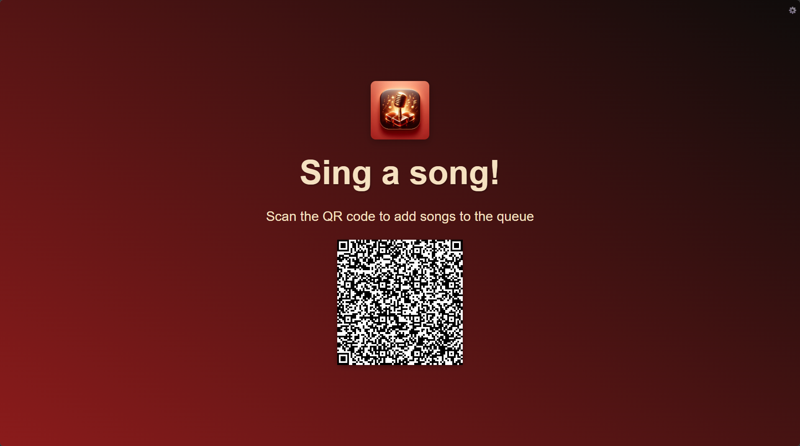
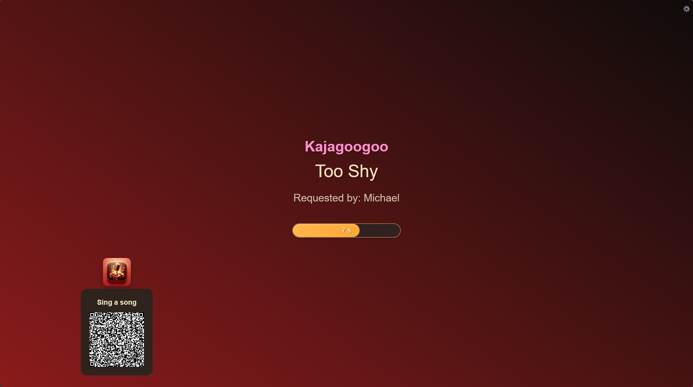

# 🎤 Karamel — Karaoke Night, Unleashed

> **Your crowd. Your songs. Your stage.**

Karamel is a modern browser-based karaoke system built for real nights out. Your music files stay on your machine — Karamel just makes them sing. Singers join from their phones, pick their songs, and you run the show from any screen in the room.

👉 **[Try the live demo](https://polite-grass-037bbc503.2.azurestaticapps.net/)**

---

---

## Why Karamel?

- 🎵 **Zero upload. Zero cloud. Zero drama.** Your MP3s and CDG files never leave your device — Karamel reads them directly from your folder.
- 📱 **Singers use their phones.** Share a QR code and anyone in the room can browse your library and add songs to the Playlist — no app install needed.
- 🖥️ **Run the show from anywhere.** Pause, skip, and reorder the queue from your laptop, tablet, or front-of-house screen.
- ⚡ **Configure once - enjoy then.** Playlist auto advances and proclaims who is the next singer. You may adjust the playlist, but if you don't want to, it runs on its own.
- 🗂️ **Export your library.** Generate artist and title CSV files from your song folder in seconds — great for printed songbooks or spreadsheet management.

---

## Features

| Category | What you get |
|---|---|
| **Playback** | CDG+MP3 and Video playback, automatic song advancement with configurable countdown |
| **Share** | QR code for instant singer onboarding |
| **Singers** | Library search, artist A–Z browse, view playlist |
| **Home Setup** | Simplified UI for Sing at Home |
| **Admin Controls** | Pause / Resume / Skip, drag-to-reorder queue, remove songs, runtime config panel |
| **Export** | Manage your Library or create old fashioned song lists. Scan any folder and download artists.csv, titles.csv, and a duplicates report |

### Supported Formats

| Format | Description |
|---|---|
| **CDG + MP3** (bare) | Matching `.cdg` and `.mp3` files in the same folder |
| **CDG + MP3** (zipped) | One `.cdg` + `.mp3` pair per `.zip` file |
| **Video** (`.mp4`) | Standard MPEG-4 video file — artist/title parsed from ID3 tags or filename |
| **Video** (`.m4v`) | iTunes-compatible MPEG-4 video file — same scanning rules as `.mp4` |

---

## Quick Start

> ⚠️ **Chrome or Edge required** — Karamel uses the File System Access API, which is not supported in Firefox or Safari.

1. Open **[Karamel](https://polite-grass-037bbc503.2.azurestaticapps.net/)** in Chrome or Edge.
2. Click **Select Folder** and choose your local karaoke song directory.
3. Share the generated **Singer link** (or QR code) with your crowd — they're ready to pick songs.

📖 **[Read the full User Manual](MANUAL.md)** for everything from session sharing to CSV exports.

---

## Attributions

This project uses the following third-party libraries. See [THIRD-PARTY-NOTICES.md](THIRD-PARTY-NOTICES.md) for details and license information.

- **CDGraphics.js** — CDG rendering (MIT). https://github.com/bhj/cdgraphics
- **jsmediatags** — ID3 tag extraction (LGPL-3.0). https://github.com/aadsm/jsmediatags
- **QRCode.js** — QR code generation (MIT). https://github.com/davidshimjs/qrcodejs
- **Fluxor** — Flux/Redux state management for Blazor (MIT). https://github.com/mrpmorris/Fluxor
- **Bootstrap Icons** — Icon library (MIT). https://icons.getbootstrap.com

For full license text, see the [LICENSE](LICENSE) file and [THIRD-PARTY-NOTICES.md](THIRD-PARTY-NOTICES.md).
